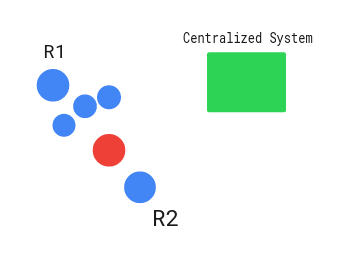

# SVT_Robotics_Challenge

Problem Statement: Make a function that takes 3 input arguments loadId,X,Y of the load and returns the best robot that can pick up that load in the following format:
```
{
    robotId: 58,
    distanceToGoal: 49.9, //Indicates how far the robot is from the load which needs to be moved.
    batteryLevel: 30 //Indicates current battery level of the robot.
}
```
## Installations
I have used python language for coding the functions.I have also used additional libraries that can perform HTTP Request, Performing mathematical functions and performing array operations. Below are the instructions to install those libraries:

1.Numpy Library - To Perform Array Operations
- ```pip3 install numpy```

2.Requests Library - To perform HTTP Request
- ```pip3 install requests```

3.Math Library - To perform Math Operations
- ```pip3 install python-math```

4.Random Library - To Randomly Generate Load id and Its position
- ```pip3 install random2```

5.Json Library - Loading the .json file data locally when there is no internet.
- This Library is already there in python.

I have made a requirements.txt file which you can use to install all these commands with one go like this
- ```pip3 install -r requirements.txt```

## My Solution and Documentation
For my solution I made a class called SVTBot that contains all the necessary functions to find the best robot that can pick up load. Given below is a overview of all the functions that I have made within SVTBot Class:

1. get_random_load(args:None): This function generates a random load and returns its id and position(x,y). x,y and id are generated randomly using the random library in python.

2. remove_zero_battery_level(args:None): This function removes the robots with zero battery level as they are of no use to pick up and transport the load without a battery. It reads API data and then finds out the robot with zero battery level.

3. get_robot_params(args:None): This function finds the robot's id,battery level, its x and y coordinates and then returns them. It reads API data to get these parameters of the robot.

4. calculate_distance(x1,x2,y1,y2): This function calculates the distance between the robot and load.Here (x1,y1) is the robot's position and (x2,y2) is the load's position. It calculates the distance using distance formula sqrt((x2-x1)^2 + (y2-y1)^2 and then returns it.

5. find_highest_battery_level_robot(distances,batteries): This function calculates the highest battery level robot when more than 1 robot lies within 10 distance units. It takes list of distances and battery leves as an argument and returns the index of robot which has highest battery level.

6. find_robot(x,y,id): This function takes the load (x,y,id) as an argument and returns the robot (id,distance_to_goal,battery level) thats best to transport the load.(closest to load and has decent battery level). If there are more than 1 robot within 10 distance units it returns the robot with highest battery level.

## Approach
1. I first get the data from API Endpoint using HTTP Request.
2. After getting the data the program remove all the robots which have zero battery levels.
3. After that the program generates random load configuration and feeds it to the function which find the robot for transporting that load.
4. The function calculates the distance of each robot from the load and then with help of that distance and battery levels finds the best robot that can transport the load.
5. Finally the output is displayed as per the requirements.

## Instructions for Running and Testing the Program
The repository contains a folder called code which has the main function program. Other files in the repository are README.md which contains the instructions to run the program and testing it. Following is the structure of the repository:

SVT_Robotics Challege
- Code
- README.md

To run the program go to the folder where the python program is saved and then run the python file. Given below are the steps to execute the program:

1. ```cd ~/SVT_Robotics_Challenge/Code```
2. ```python3 main.py```

To test the program go the Unit_Tests Folder and run the program unit_tests.py. The unit test program checks for python version, installations and the distance calculation function. If all goes correct you should't see any error and program should execute with no output. If something is missing assertion error will be displayed in the terminal.

1. ```cd ~/SVT_Robotics_Challenge/Unit_Tests```
2. ```python3 unit_tests.py```

## What Next?


1. The method of finding robot based on its battery level and distance to transport the load is good but not accurate and is slow.Time is equally important when there are lot of tasks to complete and plays an important role in analyzing robot's performance. Consider the image above:

Here suppose R1 robot has battery level as 84,distance of 8.08 units and R2 has distance 8.15, battery level as 73. what shpuld be the output according to the logic above? The program will output R1 Robot as the ideal robot for transporting load as both lie within 10 units and R1 has more battery level. But lets look closely now. In front of R1 there lie some obstructions which doesn't let R1 travel directly to the goal even though its seems quite near. This will make R1 travel longer path compared to R2. Basically the path for R1 has more cost than R2. Here the right robot to choose will be R2 as the path of R2 has lowest cost plus it will save a lots of time. 

To overcome this we can add additional output parameter as cost which will be calculated using planning algorithm and considering distance, cost and battery level take the decision accordingly.Also we should also associate battery level with how much distance robot has to travel to pick, place the goal as well as check if the battery level is sufficient or not for the robot to accomplish the task. For experimenting I will add 1 battery level === 1 unit distance.

This solution will save lots of time and make the function. more accurate.

2. Also apart from implementing additional parameters I would also to make a visualizer that will be more useful for debugging and testing. All the api endpoint data will be used and with the help of that I will make 2D simulation of robot and load positions on xy plane. It will look very similar to picture above. I will make the visualizer in pygame library in python.

3. I would also like to implement a camera feed on top so that it gets a clear picture of where robots are now in their warehouse. This would help in local testing or in situations when the connection to internet is disrupted. With the help of vision we can detect where all the robots are in the warehouse.By doing this I will get all the robot's parameters.